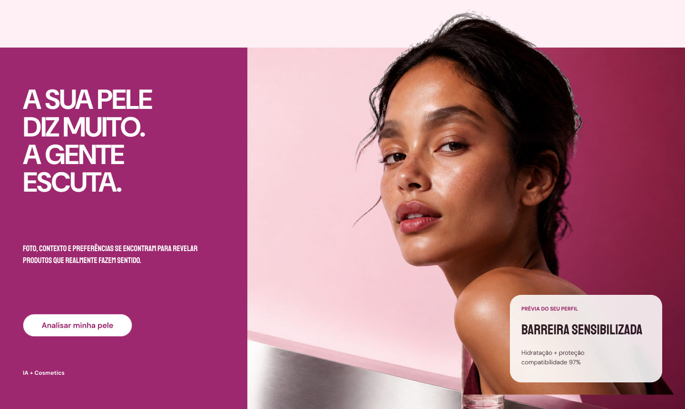
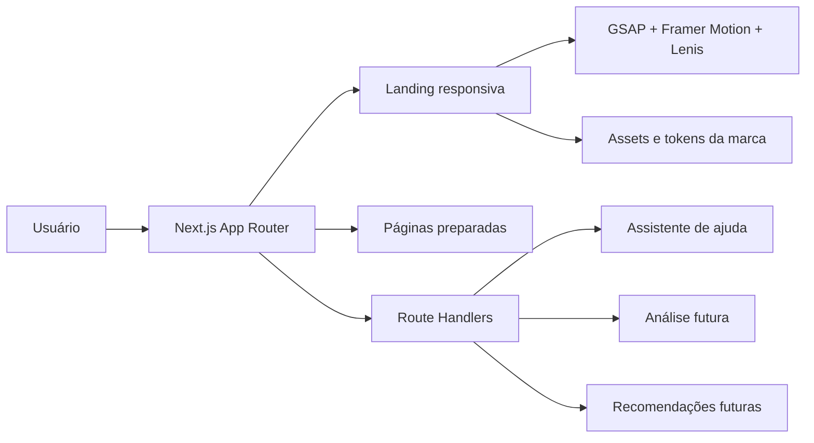

# D’Accord

> **Beleza guiada pela sua pele.** Uma experiência editorial de skincare inteligente que transforma foto, contexto e preferências em escolhas mais claras e coerentes.




## Sobre o projeto

D’Accord é o rebranding e a base técnica de uma plataforma de curadoria de skincare. A landing apresenta o propósito da marca, explica a jornada de análise, demonstra uma recomendação de produto e prepara o caminho para as telas de diagnóstico, questionário e resultados.

O projeto traduz o frame oficial do Figma para uma aplicação responsiva em Next.js, preservando a direção editorial da marca e adicionando uma arquitetura pronta para evoluir sem reescrever a landing.

- [Arquivo no Figma — D’Accord: Landing Page e Telas Principais](https://www.figma.com/design/p9TFscb93b0H2kBBO7qLYD/D%E2%80%99Accord-%E2%80%94-Landing-Page-e-Telas-Principais?node-id=7-13)
- Página de referência: `Screens`
- Frame principal: `25:56` — `V2 · 01 · Landing Page — Modelo adaptado`

## Destaques

- landing imersiva com seções de `100dvh` e navegação por estágios;
- scroll guiado e suave com Lenis, incluindo uma etapa interna de recomendação;
- animações com GSAP e Framer Motion, respeitando `prefers-reduced-motion`;
- hero em camadas: fundo, modelo HD com transparência real e card editorial;
- composição responsiva específica para desktop e mobile;
- carrossel de passos no mobile para reduzir carga visual;
- chatbot de ajuda integrado à experiência;
- páginas e contratos de API preparados para as próximas fases;
- metadata completa, sitemap, robots, manifest, Open Graph, Twitter Cards e JSON-LD;
- identidade visual ortogonal: cantos retos por padrão em toda a interface.

## Stack

| Camada | Tecnologia | Papel |
| --- | --- | --- |
| Aplicação | Next.js 16 + App Router | SSR, rotas, metadata e APIs |
| Interface | React 19 + TypeScript | componentes e contratos tipados |
| Estilos | Tailwind CSS 4 + CSS responsivo | layout, tokens e direção visual |
| Movimento | GSAP | entrada e composição da hero |
| Transições | Framer Motion | revelações, cards e estados visuais |
| Scroll | Lenis | suavização e navegação por seções |
| Tipografia | Fontsource | fontes locais e estabilidade de renderização |
| Qualidade | ESLint + TypeScript | análise estática e segurança de tipos |

## Experiência e movimento

O scroll funciona como parte da narrativa da landing:

1. cada seção ocupa a altura útil da tela;
2. um gesto de scroll conduz para o próximo painel;
3. a seção do produto possui um estágio intermediário antes de liberar a próxima seção;
4. transições de opacidade, deslocamento e máscara criam a sensação de mesclagem entre telas;
5. usuários com redução de movimento ativada recebem uma experiência simplificada.

No mobile, a interface evita apresentar todos os passos ao mesmo tempo. O componente `MobileStepDeck` mostra um card por vez, como um baralho editorial navegável.

## Arquitetura



```text
src/
├── app/
│   ├── api/                 # contratos HTTP e assistente
│   ├── analise/             # fluxo futuro de análise por foto
│   ├── questionario/        # perfil e preferências
│   ├── recomendacoes/       # curadoria futura
│   ├── layout.tsx           # metadata global e providers
│   └── page.tsx             # landing + dados estruturados
├── components/
│   ├── landing/             # composição da landing e deck mobile
│   ├── motion/              # scroll e revelações por estágio
│   └── ui/                  # botões, chatbot e componentes compartilhados
├── lib/                     # configuração do site e conteúdo do assistente
└── types/                   # contratos de API

docs/
├── ARCHITECTURE.md
├── BRANDING.md
├── brand-assets/            # fontes e controles de qualidade dos assets
└── preview/                 # imagens usadas na documentação

public/images/               # assets servidos pela aplicação
scripts/                     # utilitários de tratamento dos assets da hero
```

## Rotas

| Rota | Estado | Descrição |
| --- | --- | --- |
| `/` | pronta | landing page principal |
| `/analise` | preparada | entrada da análise por foto |
| `/questionario` | preparada | contexto, restrições e preferências |
| `/recomendacoes` | preparada | resultados e curadoria de rotina |
| `/produtos` | preparada | catálogo editorial |
| `/sobre` | preparada | narrativa institucional |
| `/privacidade` | preparada | diretrizes de privacidade |
| `/contato` | preparada | canal de contato futuro |

## APIs

| Método | Endpoint | Estado | Finalidade |
| --- | --- | --- | --- |
| `GET` | `/api/health` | disponível | verificação de saúde da aplicação |
| `GET` | `/api/help` | disponível | informações e sugestões do assistente |
| `POST` | `/api/help` | disponível | respostas de ajuda sobre o uso da experiência |
| `POST` | `/api/analysis` | contrato `501` | futura integração de análise de pele |
| `GET` | `/api/recommendations` | contrato `501` | futuro motor de compatibilidade e curadoria |

As APIs planejadas retornam `501 Not Implemented` de forma intencional até a conexão de provedores, consentimento, armazenamento seguro e regras de negócio.

## SEO

A estrutura de SEO está centralizada em `src/app/layout.tsx` e `src/lib/site-config.ts`:

- título, descrição, canonical e palavras-chave em português;
- Open Graph e Twitter Card;
- `robots.txt` e `sitemap.xml` gerados pelo App Router;
- web manifest com identidade D’Accord;
- dados estruturados `Organization`, `WebSite` e `WebPage` em JSON-LD;
- HTML semântico, hierarquia de títulos e textos alternativos;
- fontes locais para reduzir instabilidade visual e dependências externas.

Termos estratégicos usados de forma natural incluem **skincare inteligente**, **análise de pele**, **rotina de skincare personalizada**, **curadoria de cosméticos**, **pele sensível**, **barreira cutânea** e **cosméticos compatíveis**.

> A experiência oferece orientação cosmética e não substitui uma avaliação dermatológica.

## Identidade visual

| Token | Cor | Uso principal |
| --- | --- | --- |
| `--color-plum` | `#2B1924` | texto e fundos de alto contraste |
| `--color-brand` | `#9D286F` | CTAs e grandes áreas de marca |
| `--color-brand-dark` | `#941564` | detalhes e texto de marca |
| `--color-brand-border` | `#B4568C` | contornos e foco |
| `--color-nude` | `#D9B7A7` | blocos editoriais |
| `--color-canvas` | `#FFF0F5` | fundo suave |
| `--color-surface` | `#FFFFFF` | superfícies e contraste |

Tipografia:

- **DM Sans** para navegação, corpo, botões e dados funcionais;
- **Staatliches** para títulos editoriais;
- **Belleza** para a assinatura delicada da marca.

Regra de geometria: o raio padrão é `0`. Botões, cards, imagens, campos, modais e indicadores permanecem com cantos retos, exceto quando houver uma decisão explícita de direção de arte.

Veja todos os fundamentos em [docs/BRANDING.md](docs/BRANDING.md).

## Executar localmente

### Pré-requisitos

- Node.js 20.9 ou superior;
- npm 10 ou superior.

### Instalação

```bash
git clone https://github.com/meumanolevi/daccord.git
cd daccord
npm ci
cp .env.example .env.local
npm run dev
```

No Windows PowerShell, use:

```powershell
Copy-Item .env.example .env.local
```

Acesse [http://localhost:3000](http://localhost:3000).

### Ambiente

```env
NEXT_PUBLIC_SITE_URL=http://localhost:3000
```

Em produção, defina `NEXT_PUBLIC_SITE_URL` com o domínio canônico para gerar URLs corretas em metadata, sitemap e dados estruturados.

## Scripts

| Comando | Ação |
| --- | --- |
| `npm run dev` | inicia o ambiente de desenvolvimento |
| `npm run build` | gera o build otimizado de produção |
| `npm run start` | executa o build de produção |
| `npm run lint` | valida padrões de código |
| `npm run typecheck` | verifica os tipos sem emitir arquivos |

## Qualidade e acessibilidade

Antes de abrir um pull request:

```bash
npm run lint
npm run typecheck
npm run build
```

Cuidados já incorporados:

- foco visível e navegação sem dependência exclusiva do mouse;
- labels e regiões com nomes acessíveis;
- `prefers-reduced-motion` para reduzir animações;
- layout sem rolagem horizontal nos breakpoints testados;
- imagens prioritárias e carregamento tardio das imagens abaixo da dobra;
- contratos de API tipados e limites básicos de entrada no chatbot.

## Pipeline da hero

A modelo da hero foi extraída novamente da fonte original do Figma em resolução integral. O asset final possui fundo transparente, cabelo reconstruído no topo e composição separada do background.

- asset de produção: `public/images/hero-model-hd-v13.png`;
- fonte e comparações: `docs/brand-assets/hero-recut-v13/`;
- script reprodutível: `scripts/build-hero-model-v13.py`.

O script requer Python 3.11+ com Pillow, NumPy e SciPy. Os assets finais já estão versionados, portanto esse passo não é necessário para executar a aplicação.

## Próximas etapas

- integrar o provedor de análise por imagem com consentimento explícito;
- conectar catálogo, ingredientes e regras de compatibilidade;
- persistir perfis e recomendações com autenticação e políticas de privacidade;
- criar testes unitários, de integração e end-to-end;
- validar Core Web Vitals e acessibilidade em ambiente publicado;
- definir observabilidade, analytics e estratégia de experimentação.

## Documentação complementar

- [Arquitetura](docs/ARCHITECTURE.md)
- [Branding](docs/BRANDING.md)

---

Construído para transformar dúvida em um ritual de skincare mais coerente — **D’Accord com a sua pele**.
